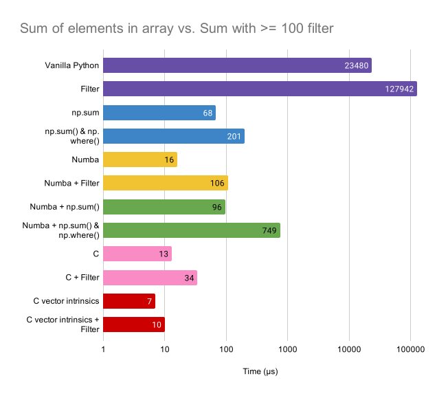

# Benchmarking SIMD

Comparison of how fast [Numba](https://numba.pydata.org/)'s autovectorization can achieve with respect to Intel C [vector intrinsics](https://software.intel.com/sites/landingpage/IntrinsicsGuide/#techs=SSE,SSE2,SSE3,SSSE3).

Read my blog post for more details on my experience working with Numba! https://laurenar.net/posts/python-simd/

## Evaluation

Benchmarked 2 different programs to examine how logical complexity impacts performance.

1. Sum of all elements in an array
2. Sum of elements in array if element >= 100

Each program runs over a length 65546 integer array. Times are averaged over 1000s of iterations.

## Results

#### Array Sum

#### Array Sum with Filter

